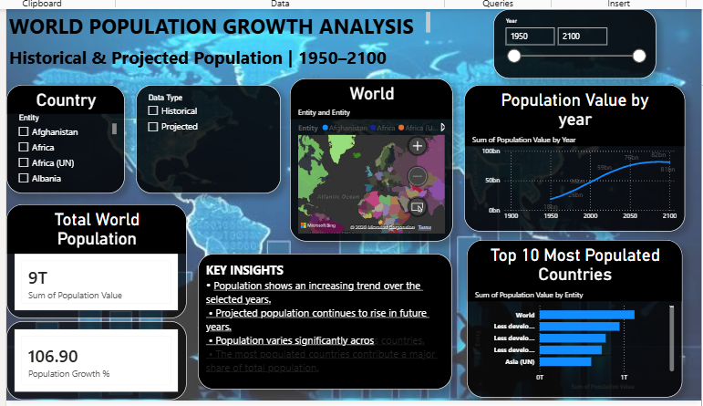

# World Population Growth Analysis

World Population Growth Analysis using Power BI to analyze historical and projected population trends from 1950 to 2100.

##  Project Overview

This project analyzes world population data to understand population growth trends across countries and years.

The dashboard provides an interactive view of:
- Historical population
- Projected population
- Population growth trends
- Top 10 most populated countries
- Country-wise population comparison

## 01. Business Question

**How has the world's population changed over time, and which countries have the highest population?**

The main objective is to analyze historical and projected population data and identify important population trends.

## 02. Data

### Data Source
Population dataset containing country-wise population information.

### Time Period
**1950 – 2100**

The dataset includes both:
- Historical population data
- Projected population data

### Data Preparation
The data was cleaned and transformed using Power Query in Power BI.

## 03. Dashboard

The Power BI dashboard includes:

-  Country Filter
-  Year Range Filter
-  Historical / Projected Data Filter
-  World Population Map
-  Population Value by Year
-  Top 10 Most Populated Countries
-  Total World Population
-  Population Growth %
-  Key Insights

## 04. Key Insights

- World population shows an increasing trend over the selected years.
- Projected population continues to rise in future years.
- Population varies significantly across countries.
- The most populated countries contribute a major share of the total population.
- The dashboard allows users to compare population trends interactively.

## 05. Tools & Technologies

- Power BI
- Power Query
- Data Visualization
- Data Analysis
- Data Cleaning

## 06. Dashboard Preview

World Population Growth Analysis dashboard showing historical and projected population trends from 1950 to 2100.

##  Project Creator

**Krina Kasundra**

B.Tech – Information Technology
